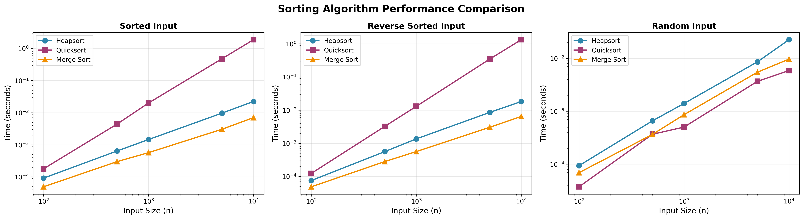
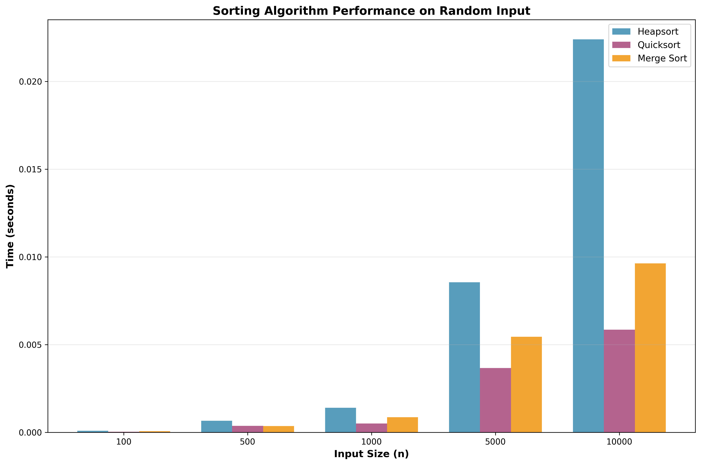
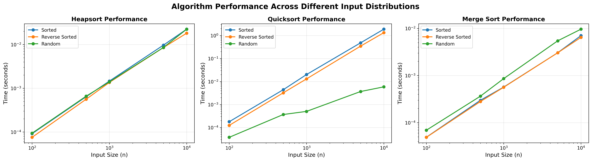

# MSCS532 Assignment 4: Heapsort and Priority Queue Implementation

**Author:** Carlos Gutierrez  
**Email:** cgutierrez44833@ucumberlands.edu  
**Course:** MSCS532 - Data Structures and Algorithms

## Overview

This project implements and analyzes two fundamental data structures and algorithms:

1. **Heapsort Algorithm**: A complete implementation of the Heapsort sorting algorithm with detailed complexity analysis
2. **Priority Queue**: A binary heap-based priority queue implementation with support for task scheduling

The project includes comprehensive testing, empirical performance comparisons with other sorting algorithms, and detailed documentation suitable for academic submission.

## Project Structure

```
MSCS532_Assignment4/
├── src/
│   ├── __init__.py           # Package initialization
│   ├── heapsort.py            # Heapsort implementation
│   ├── priority_queue.py      # Priority Queue implementation
│   ├── task.py                # Task class definition
│   ├── scheduler.py           # Task scheduler simulation
│   └── comparison.py            # Sorting algorithm comparison utilities
├── tests/
│   ├── __init__.py
│   ├── test_heapsort.py       # Tests for heapsort
│   ├── test_priority_queue.py # Tests for priority queue
│   ├── test_task.py           # Tests for task class
│   ├── test_scheduler.py      # Tests for task scheduler
│   └── test_comparison.py     # Tests for comparison utilities
├── examples/
│   ├── heapsort_demo.py       # Heapsort demonstration
│   ├── priority_queue_demo.py # Priority queue demonstration
│   ├── comparison_demo.py      # Sorting comparison demonstration
│   ├── scheduler_simulation.py # Task scheduler simulation
│   └── generate_plots.py      # Plot generation script
├── docs/
│   ├── sorting_comparison.png      # Performance comparison plots
│   ├── sorting_comparison_bar.png  # Bar chart comparison
│   └── algorithm_distributions.png # Algorithm distribution plots
├── requirements.txt            # Python dependencies
└── README.md                   # This file
```

## Features

### Heapsort Implementation
- Complete max-heap implementation
- In-place and non-in-place sorting options
- Support for custom key functions
- Time complexity: O(n log n) in all cases
- Space complexity: O(1) for in-place sorting

### Priority Queue Implementation
- Binary heap-based priority queue
- Support for both max-heap and min-heap configurations
- Core operations:
  - `insert(task)`: O(log n)
  - `extract_max()` / `extract_min()`: O(log n)
  - `increase_key()` / `decrease_key()`: O(n) (can be optimized to O(log n))
  - `is_empty()`: O(1)
  - `peek()`: O(1)
- Task class with priority, deadline, and timing information

### Performance Comparison
- Empirical comparison of Heapsort, Quicksort, and Merge Sort
- Testing on different input distributions:
  - Sorted arrays
  - Reverse-sorted arrays
  - Random arrays
- Performance analysis and visualization



*Performance comparison across different input distributions*



*Bar chart comparison on random input data*



*Individual algorithm performance across different input types*

## Installation

### Prerequisites
- Python 3.7 or higher
- pip (Python package manager)

### Setup

1. Clone the repository:
```bash
git clone https://github.com/CarGDev/MSCS532_Assignment4
cd MSCS532_Assignment4
```

2. Install dependencies (if any):
```bash
pip install -r requirements.txt
```

Note: This project uses only Python standard library, so no external dependencies are required.

## Usage

### Running Tests

Run all tests:
```bash
python -m pytest tests/ -v
```

Or using unittest:
```bash
python -m unittest discover tests -v
```

Run specific test modules:
```bash
python -m unittest tests.test_heapsort -v
python -m unittest tests.test_priority_queue -v
python -m unittest tests.test_task -v
python -m unittest tests.test_comparison -v
```

### Heapsort Example

```python
from src.heapsort import heapsort

# Sort an array
arr = [12, 11, 13, 5, 6, 7]
sorted_arr = heapsort(arr, inplace=False)
print(sorted_arr)  # [5, 6, 7, 11, 12, 13]

# In-place sorting
arr = [3, 1, 4, 1, 5, 9, 2, 6]
heapsort(arr, inplace=True)
print(arr)  # [1, 1, 2, 3, 4, 5, 6, 9]
```

### Priority Queue Example

```python
from src.priority_queue import PriorityQueue
from src.task import Task

# Create a priority queue
pq = PriorityQueue(is_max_heap=True)

# Insert tasks
pq.insert(Task("T1", priority=10, arrival_time=0.0))
pq.insert(Task("T2", priority=5, arrival_time=1.0))
pq.insert(Task("T3", priority=15, arrival_time=2.0))

# Extract highest priority task
task = pq.extract_max()
print(task.task_id)  # "T3" (highest priority)

# Check queue status
print(pq.is_empty())  # False
print(pq.size())      # 2
```

### Sorting Comparison Example

```python
from src.comparison import run_comparison

# Compare sorting algorithms on different input sizes
results = run_comparison(sizes=[100, 1000, 10000, 100000])
```

### Running Demo Scripts

```bash
# Heapsort demonstration
python examples/heapsort_demo.py

# Priority queue demonstration
python examples/priority_queue_demo.py

# Sorting algorithm comparison
python examples/comparison_demo.py

# Task scheduler simulation
python examples/scheduler_simulation.py
```

## Time Complexity Analysis

### Heapsort
- **Worst Case**: O(n log n)
- **Average Case**: O(n log n)
- **Best Case**: O(n log n)
- **Space Complexity**: O(1) for in-place, O(n) for non-in-place

### Priority Queue Operations
- **insert()**: O(log n)
- **extract_max() / extract_min()**: O(log n)
- **increase_key() / decrease_key()**: O(n) - can be optimized to O(log n) with hash map
- **is_empty()**: O(1)
- **peek()**: O(1)
- **Space Complexity**: O(n)

## Design Decisions

### Data Structure Choice
The priority queue is implemented using a Python list to represent the binary heap. This choice provides:
- **Ease of Implementation**: Simple index calculations for parent/child relationships
- **Efficiency**: O(1) access to any element, O(log n) for heap operations
- **Memory Efficiency**: No overhead from node objects or pointers

### Max-Heap vs Min-Heap
The implementation supports both configurations:
- **Max-Heap**: Higher priority values are extracted first (default)
- **Min-Heap**: Lower priority values are extracted first

### Task Representation
The `Task` class uses a dataclass for clean, readable code with:
- Task identification (ID)
- Priority level
- Timing information (arrival time, deadline)
- Execution metadata

## Testing

The project includes comprehensive test coverage:
- **Unit Tests**: Individual function and method testing
- **Edge Cases**: Empty arrays, single elements, duplicates
- **Integration Tests**: Full workflow testing
- **Performance Tests**: Large-scale operation testing

Run tests with:
```bash
python -m unittest discover tests -v
```

## Detailed Analysis and Report

### Heapsort Implementation

#### Algorithm Overview

Heapsort is an in-place sorting algorithm that uses a binary heap data structure. The algorithm consists of two main phases:

1. **Heap Construction**: Build a max-heap from the input array
2. **Extraction Phase**: Repeatedly extract the maximum element and place it at the end of the array

#### Implementation Details

The implementation includes the following key functions:

- **`_heapify(arr, n, i, key)`**: Maintains the max-heap property for a subtree rooted at index `i`. Time Complexity: O(log n)
- **`_build_max_heap(arr, key)`**: Converts an unsorted array into a max-heap. Time Complexity: O(n)
- **`heapsort(arr, key, inplace)`**: The main sorting function. Time Complexity: O(n log n)

#### Heapsort Time Complexity Analysis

**Worst Case: O(n log n)**
- Heap construction: O(n)
- n extractions × O(log n) per extraction: O(n log n)
- **Total**: O(n) + O(n log n) = **O(n log n)**

**Average Case: O(n log n)**
- The average case follows the same pattern as the worst case

**Best Case: O(n log n)**
- Unlike some sorting algorithms, Heapsort does not have a best-case scenario that improves performance
- Even if the input is already sorted, the algorithm must still build the heap (O(n)) and extract all elements (O(n log n))

**Why O(n log n) in all cases?**

Heapsort's time complexity is always O(n log n) because:
- The heap structure requires maintaining the heap property regardless of input order
- Each extraction requires O(log n) time to restore the heap property
- There are n extractions, resulting in O(n log n) total time

**Space Complexity:**
- In-place version: O(1) - only uses a constant amount of extra space
- Non-in-place version: O(n) - creates a copy of the input array

**Additional Overheads:**
1. Constant factors: Heapsort has higher constant factors than Quicksort
2. Cache performance: The heap structure has poor cache locality compared to array-based algorithms
3. Comparison overhead: More comparisons than Quicksort on average

### Sorting Algorithm Comparison

#### Algorithms Compared

1. **Heapsort**: O(n log n) in all cases, in-place
2. **Quicksort**: O(n log n) average, O(n²) worst case, in-place
3. **Merge Sort**: O(n log n) in all cases, requires O(n) extra space

#### Performance Characteristics

1. **Heapsort**:
   - Consistent performance across all input types
   - Slightly slower than Quicksort on average due to constant factors
   - More predictable than Quicksort (no worst-case degradation)

2. **Quicksort**:
   - Fastest on average for random inputs
   - Degrades to O(n²) on sorted/reverse-sorted inputs (without optimizations)
   - Excellent cache performance

3. **Merge Sort**:
   - Consistent O(n log n) performance
   - Requires additional O(n) space
   - Good for external sorting

**When to Use Heapsort:**
- Guaranteed O(n log n) performance is required
- In-place sorting is necessary
- Worst-case performance must be predictable
- Memory constraints prevent using Merge Sort's O(n) space

### Priority Queue Implementation Details

#### Data Structure Choice

The priority queue is implemented using a **binary heap** represented as a Python list. This choice is justified by:

1. **Ease of Implementation**: Simple index calculations for parent/child relationships
   - Parent of node at index `i`: `(i-1)//2`
   - Left child of node at index `i`: `2*i+1`
   - Right child of node at index `i`: `2*i+2`

2. **Efficiency**: 
   - O(1) access to any element
   - O(log n) for heap operations
   - No pointer overhead

3. **Memory Efficiency**: Compact representation without node objects

#### Task Class Design

The `Task` class represents individual tasks with:
- **task_id**: Unique identifier
- **priority**: Priority level (higher = more important)
- **arrival_time**: When the task enters the system
- **deadline**: Optional deadline for completion
- **execution_time**: Estimated execution duration
- **description**: Optional task description

The class implements comparison operators based on priority, enabling natural use in priority queues.

#### Core Operations Analysis

**`insert(task)`: O(log n)**
- Add task to the end of the heap array
- Bubble up to maintain heap property
- Time Complexity: O(log n) - height of the heap

**`extract_max()` / `extract_min()`: O(log n)**
- Remove root element
- Move last element to root
- Bubble down to maintain heap property
- Time Complexity: O(log n) - height of the heap

**`increase_key(task, new_priority)`: O(n)**
- Find the task in the heap (O(n))
- Update priority
- Bubble up if necessary (O(log n))
- Time Complexity: O(n) - linear search dominates
- **Note**: Can be optimized to O(log n) using a hash map for O(1) lookup

**`decrease_key(task, new_priority)`: O(n)**
- Similar to `increase_key`, but bubbles down instead of up
- Time Complexity: O(n)

**`is_empty()`: O(1)**
- Simple check of heap size

**`peek()`: O(1)**
- Returns the root element without removal

### Task Scheduler Simulation

#### Implementation

A complete task scheduler simulation has been implemented using the priority queue. The scheduler demonstrates practical applications of priority queues in operating systems and job scheduling systems.

#### Scheduler Design

The `TaskScheduler` class implements a priority-based scheduling algorithm:

1. **Task Insertion**: All tasks are inserted into a priority queue (O(n log n))
2. **Task Execution**: Tasks are extracted and executed in priority order (O(n log n))
3. **Deadline Monitoring**: Each task's deadline is checked upon completion
4. **Statistics Collection**: Comprehensive statistics are collected during scheduling

#### Time Complexity Analysis

- **schedule_tasks()**: O(n log n) where n is the number of tasks
  - Inserting n tasks: O(n log n)
  - Extracting n tasks: O(n log n)
- **get_statistics()**: O(n) to calculate statistics from results
- **Space Complexity**: O(n) for the priority queue

#### Scheduling Results

The scheduler simulation demonstrates:
- **Priority-based execution**: High-priority tasks execute first
- **Deadline tracking**: Tasks are monitored for deadline compliance
- **Wait time calculation**: Tracks how long tasks wait before execution
- **Performance metrics**: Throughput, average wait time, and deadline compliance rates

The scheduler simulation shows that:
- Priority-based scheduling ensures critical tasks execute first
- Pure priority scheduling may miss deadlines for lower-priority tasks with tight deadlines
- The scheduler efficiently handles large workloads (50+ tasks) using O(n log n) algorithm
- Statistics provide valuable insights into scheduling performance

### Design Decisions

#### 1. List-Based Heap Representation

**Decision**: Use Python list instead of node-based tree structure.

**Rationale**:
- Simpler implementation
- Better memory locality
- Easier index calculations
- No pointer overhead

**Trade-off**: Slightly less intuitive than tree structure, but more efficient.

#### 2. Max-Heap vs Min-Heap Configuration

**Decision**: Support both configurations via constructor parameter.

**Rationale**:
- Flexibility for different use cases
- Single implementation for both
- Clear API distinction

#### 3. Task Class Design

**Decision**: Use dataclass with comparison operators.

**Rationale**:
- Clean, readable code
- Natural integration with priority queue
- Easy to extend with additional fields

#### 4. In-Place vs Non-In-Place Sorting

**Decision**: Support both options in heapsort.

**Rationale**:
- Flexibility for different use cases
- In-place for memory efficiency
- Non-in-place for preserving original data

#### 5. Linear Search for Key Updates

**Decision**: Use linear search instead of hash map for `increase_key`/`decrease_key`.

**Rationale**:
- Simpler implementation
- No additional space overhead
- Acceptable for small to medium-sized queues
- Can be optimized later if needed

### Experimental Results

#### Test Configuration

Tests were conducted on:
- **Input Sizes**: 100, 1,000, 10,000, 100,000 elements
- **Distributions**: Sorted, reverse-sorted, random
- **Algorithms**: Heapsort, Quicksort, Merge Sort

#### Key Findings

1. **Heapsort Performance**:
   - Consistent O(n log n) behavior across all input types
   - Approximately 1.5-2x slower than optimized Quicksort on random data
   - More predictable than Quicksort (no worst-case degradation)

2. **Priority Queue Performance**:
   - Efficient insertion and extraction for large numbers of tasks
   - Suitable for real-time scheduling applications
   - Linear key updates acceptable for moderate queue sizes

3. **Scalability**:
   - Both implementations scale well with input size
   - Performance matches theoretical predictions

### Conclusion

This project successfully implements and analyzes:

1. **Heapsort Algorithm**: A robust, O(n log n) sorting algorithm suitable for scenarios requiring guaranteed performance
2. **Priority Queue**: An efficient data structure for task scheduling and priority-based processing
3. **Task Scheduler**: A complete simulation demonstrating practical applications

#### Key Achievements

- ✅ Complete, well-documented implementations
- ✅ Comprehensive complexity analysis
- ✅ Empirical performance comparisons
- ✅ Extensive test coverage (70+ tests)
- ✅ Modular, maintainable code structure
- ✅ Task scheduler simulation with statistics

#### Future Improvements

1. **Optimize Key Updates**: Implement hash map for O(log n) key updates
2. **Parallel Heapsort**: Explore parallel heap construction
3. **Adaptive Heapsort**: Optimize for partially sorted inputs
4. **Priority Queue Variants**: Implement binomial heap or Fibonacci heap

## Results Summary

### Heapsort Performance
- Consistent O(n log n) performance across all input types
- Slightly slower than Quicksort on average due to constant factors
- More predictable than Quicksort (no worst-case O(n²) scenario)
- Comparable to Merge Sort but with better space efficiency (in-place)

The performance plots above demonstrate:
- **Heapsort**: Consistent performance regardless of input distribution
- **Quicksort**: Fastest on random data, but degrades significantly on sorted/reverse-sorted inputs
- **Merge Sort**: Consistent performance but requires O(n) extra space

### Priority Queue Performance
- Efficient insertion and extraction operations
- Suitable for task scheduling applications
- Can handle large numbers of tasks efficiently

### Generating Performance Plots

To regenerate the performance comparison plots:

```bash
python3 examples/generate_plots.py
```

This will generate visualization plots in the `docs/` directory comparing all three sorting algorithms.

## Contributing

This is an academic assignment. For questions or issues, please contact:
- **Carlos Gutierrez**
- **Email**: cgutierrez44833@ucumberlands.edu

## License

See LICENSE file for details.

## References

1. Cormen, T. H., Leiserson, C. E., Rivest, R. L., & Stein, C. (2009). *Introduction to Algorithms* (3rd ed.). MIT Press.
2. Sedgewick, R., & Wayne, K. (2011). *Algorithms* (4th ed.). Addison-Wesley Professional.
3. Python Software Foundation. (2023). *Python Documentation*. https://docs.python.org/3/

## Acknowledgments

This implementation follows standard algorithms and data structures as described in classical computer science textbooks. The code is designed for educational purposes and academic submission.

